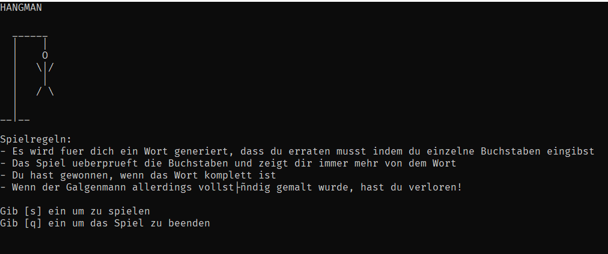

A simple program that randomly takes words and let's the user play hangman with it. It validated input and checks how the player is progressing.
Prints ascii images of the different stages of the hangman.

